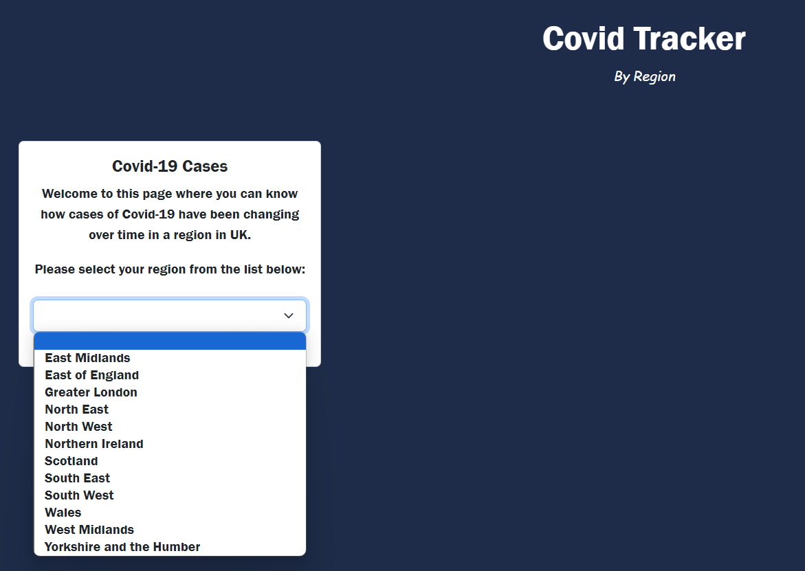
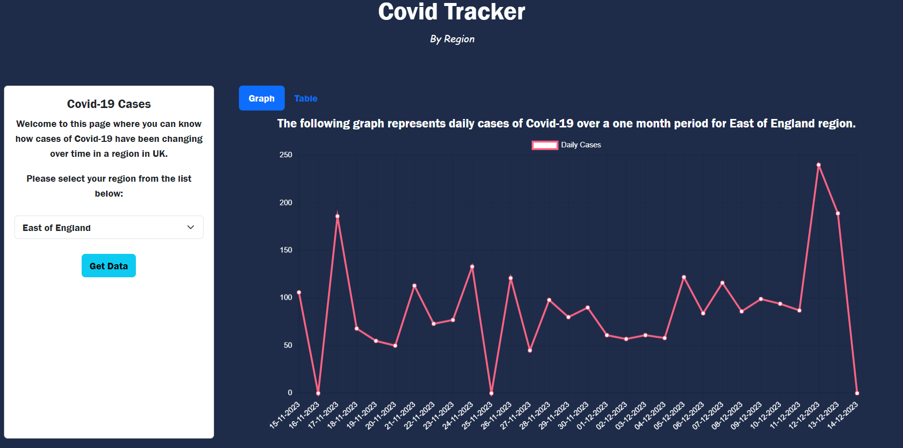
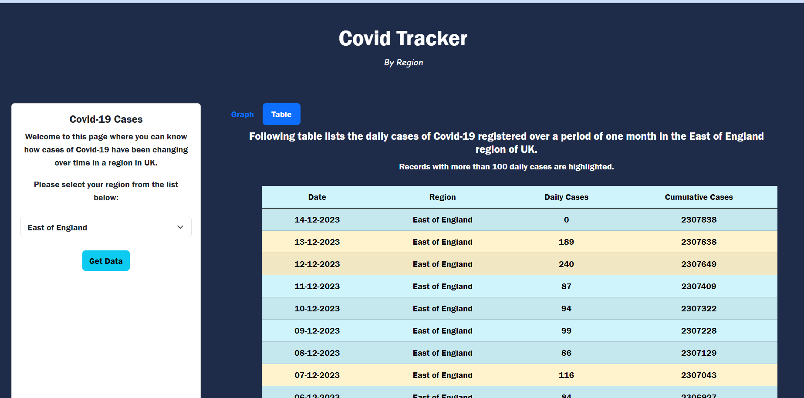

# Covid Tracker
[](https://opensource.org/licenses/MIT)

## Description

The [Covid Tracker](https://jayapk21.github.io/covid-tracker/) web page is designed to provide insights into the changing trends of Covid-19 cases over time in specific regions of the United Kingdom. The application utilizes APIs provided by the UK Government to collect accurate and up-to-date data on Covid-19 cases.

This tool is developed for residents of the UK who are interested in understanding how Covid-19 cases have fluctuated over time in their respective regions. To create this application, daily Covid-19 cases have been collected over a one-month period for selected regions. The data is then presented visually through graphs and tables, offering users a clear understanding of how daily cases have evolved over time. This visual representation enhances the user's comprehension of the data and provides valuable insights into the trends.

## User Story

```
As a UK citizen, I would like to know how cases of COVID-19 have been changing over time in my region.
```

## Features

* Any region in UK can be selected for viewing the data.
* Covid-19 data is displayed as a graph and in tables for the region selected.

## Future Features

The following suggested features can ge added to the application for future development:
 
* The user is able to choose the time period over which the Covid-19 data is required for the region.
* Multiple graphs can be displayed on a single chart for different regions at a time.

## Installation

The web page has been deployed on Github pages and can be accessed from the following link:

https://jayapk21.github.io/covid-tracker/

For running locally, please follow the steps below:

* Clone this repository into your local machine.
* Run the below command in CLI from the repository's root location, to download all required packages and dependencies:

 ```
 npm install
 ```

* Run **npm start** to run the application on LocalHost and can be accessed through the link ***http://localhost:3000/covid-tracker***

```
npm start
```

## Technologies used
* ReactJS
* React Redux
* Bootstrap

## Usage

Following image shows the home page for the application.



Graph containing the daily cases is displayed for the selected region.



Table containing the daily cases is displayed for the selected region.



## Testing

Testing for the application has been done using Jest library.
The test files are contained in the ```src/tests``` folder of the project, and can be run using the command ```npm run test a```

## License
[](https://opensource.org/licenses/MIT)